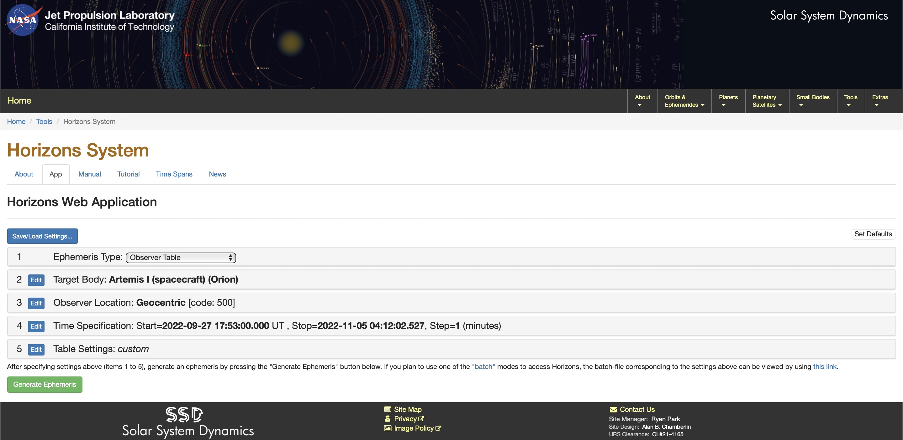

<p align="center">
  
  <h1 align="center">Simetral</h1>
</p>

<p align="center">
  ✨ Artemis I mission GraphQL Sever with NASA Horizons data 🛰 - Basic example of Graphem
</p>


> ⚠️ The data will be updated because Artemis 1 mission will reschedule for later.


## 📦 Purpose

This project is a GraphQL server that allows you to query real-time and historical data from certain data obtained from NASA Horizons for the Artemis I mission.

The server takes the information from a CSV from September 27 to November 5 with a step of 1 minute (one row per minute) from a geocentric observer to the Orion spacecraft. Ready to be sent to NASA Open MCT connected with the Graphem plugin.

The information was collected with NASA Horizons.

## 🛰 How to use?

### Download Simetral GraphQL server
Once you cloned this repository in your local environment, install the dependencies.

```sh
cd simetral
npm install
```

### Create a client.
Great! Now you have a GraphQL server, we need a client. You can use your own client.

But I suggest you to download a very simple example like the `openmct-tutorial` client itself.

```
git clone https://github.com/nasa/openmct-tutorial.git
cd openmct-tutorial
npm install
```

### Connect with Graphem
Now inside the `index.html` of the client.

Install Graphem.
```sh
npm i graphem
```

Import Graphem using the following `<script>` tag inside the `<head>`.
```html
<script src="node_modules/graphql-ws/umd/graphql-ws.js"></script>
```

And finally install de plugin using `install()` method.
```js
openmct.install(Graphem({
  namespace: "rocket.taxonomy", // Custom namespace
  key: "orion", // Custom Key
  dictionaryPath: "/dictionary.json", // Path of dictionary
  telemetryName: "rocket.telemetry", // Name of telemetry
  subscriptionName: "formatted", // Name of the <GraphQL> subscription for historical telemetry
  urn: "localhost:4000/graphql" // Source URN (Uniform Resource Name)
}));
```


## 🚀 Horizons Data

Below is a brief explanation using the data collected from the **Horizons System**:



### dRA\*cosD

The angular rate of change in aparent RA and DEC of the target. This is with respect to the non-inertial IAU76/80 Earth true equator and equinox of-date reference frame. d(RA)/dt is multiplied by the cosine of declination
to provide a linear rate in the plane-of-sky.

**Units:** ARCSECONDS PER HOUR

### Illumination %

Fraction of the target objects' assumed circular disk illuminated by Sun (phase), as seen by the observer.

**Units:** PERCENT

### Sun range

The Sun's apparent range ("r", light-time aberrated).

### Sun range rate

The Sun's apparent range-rate ("rdot") relative to the target center.

### Delta apparent range

Apparent range ("delta", light-time aberrated) and range-rate ("delta-dot") of the target center relative to the observer. A positive "deldot" means the target center is moving away from the observer, negative indicates movement toward the observer.

**Units:** AU and KM/S

### Delta apparent range - dot

Apparent range-rate ("delta-dot") of the target center relative to the observer.

### S-O-T,/r

Sun-Observer-Target apparent SOLAR ELONGATION ANGLE seen from the observers' location at print-time.

### PsAng

The position angles of the extended Sun-to-target radius vector ("PsAng") and the negative of the targets' heliocentric velocity vector ("PsAMV"), as seen in the observers' plane-of-sky, measured counter-clockwise (east) from reference-frame north-pole. Primarily intended for ACTIVE COMETS, "PsAng" is an indicator of the comets' gas-tail orientation in the sky (being in the anti-sunward direction) while "PsAMV" is an indicator of dust-tail orientation.
Units: DEGREES

### PsAMV

The position angles of the extended Sun-to-target radius vector ("PsAng") and the negative of the targets' heliocentric velocity vector ("PsAMV"), as seen in the observers' plane-of-sky, measured counter-clockwise (east) from reference-frame north-pole. Primarily intended for ACTIVE COMETS, "PsAng" is an indicator of the comets' gas-tail orientation in the sky (being in the anti-sunward direction) while "PsAMV" is an indicator of dust-tail orientation.
Units: DEGREES

### GlxLon

Observer-centered Galactic System II (post WW II) longitude and latitude of the target centers' apparent position, with light-time, gravitational deflection of light, and stellar aberrations. Units: DEGREES

### GlxLat

Observer-centered Galactic System II (post WW II) longitude and latitude of the target centers' apparent position, with light-time, gravitational deflection of light, and stellar aberrations. Units: DEGREES

### Sky_motion, Sky_mot_PA, RelVel-ANG

Total apparent angular rate of the target in the plane-of-sky. "Sky_mot_PA" is the position angle of the target's direction of motion in the plane-of-sky, measured counter-clockwise from the apparent of-date north pole direction. "RelVel-ANG" is the flight path angle of the target's relative motion with respect to the observer's line-of-sight, in the range [-90,+90], where positive values indicate motion away from the observer, negative values are toward the observer:

-90 = target is moving directly toward the observer
0 = target is moving at right angles to the observer's line-of-sight
+90 = target is moving directly away from the observer

UNITS: ARCSECONDS/MINUTE, DEGREES, DEGREES

## 📃 License

Distributed under the MIT License.
See [`LICENSE`](./LICENSE) for more information.
